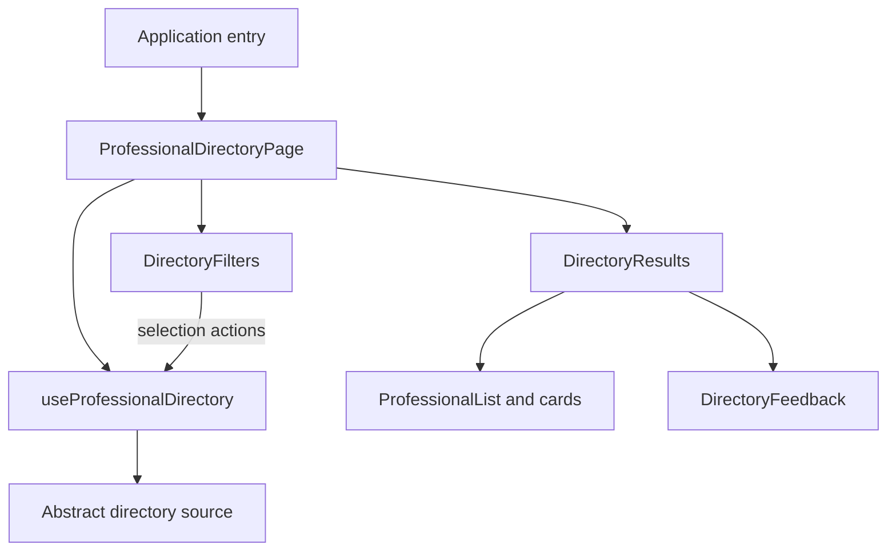

# Professional directory frontend design

Status: Proposed technical design for implementation planning.
Behavior source: [spec.md](spec.md). The user's request authorizes design against
the current specification; its proposed product assumptions remain provisional.

## Evidence and decision boundaries

Confirmed: this is a greenfield, frontend-only repository with no application,
package manifest, framework setup, test runner, or established code patterns.
React is the requested architecture. Public access, directory states,
verification visibility, responsive behavior, and accessibility come from the
specification. No backend contract is available.

Choose feature-local React components and state, plain CSS, and a single abstract
data boundary. Do not add a global store, query/cache library, UI kit, or router
solely for this capability. Toolchain, React version, language choice, entry URL,
and deployment remain separate bootstrap decisions for planning; no dependencies
are installed by this design.

## Components and module boundaries

Proposed feature location: `src/features/professional-directory/`. These are
future application modules, not files created in this step.

| Component/module | Responsibility and inputs | State ownership |
| --- | --- | --- |
| `ProfessionalDirectoryPage` | Public page heading, purpose, composition, and feature boundary wiring; receives a stable directory source from the application entry point. | Calls the controller hook; no separate copy of its state. |
| `useProfessionalDirectory` | Coordinate selections, source operations, retries, and accepted outcomes. Expose current state and semantic actions to the page. | Owns the feature reducer and operation lifecycle. |
| `DirectoryFilters` | Labeled native selects and clear action; receives agreed options, current selections, readiness, and change/clear callbacks. | Controlled; no duplicate selected values. |
| `DirectoryResults` | Render exactly one result branch from controller state. Provide a stable results region. | Stateless. |
| `ProfessionalList` | Semantic list of professional cards for an accepted result. | Stateless; uses stable internal presentation keys. |
| `ProfessionalCard` | Name, category, affiliation, verification, optional location and image; no booking/profile navigation. | Only local image-failure fallback state, reset if image changes. |
| `VerificationBadge` | Text for the internal verified, not-verified, or unavailable presentation status. | Stateless; does not interpret external values. |
| `DirectoryFeedback` | Loading, directory-empty, no-matches, and error content and recovery buttons. | Stateless; controller owns retry/clear behavior. |
| `directorySource` boundary | Supply agreed option vocabulary and a normalized eligible result for a selection snapshot. Hide data access and matching location. | Source lifecycle only; no independent UI selection state. |
| `directoryState` | Pure reducer and derived state selectors. | Defines transitions; performs no asynchronous work. |

Use sibling modules for the controller, reducer, source boundary, presentation
model, and CSS. Split files only where these responsibilities warrant it; this
is not a generic service-layer or component-system mandate.

## Internal presentation model and external boundary

The following are frontend concepts only. They do not define wire properties,
request bodies, response schemas, endpoints, backend enums, or database records.

- Selection: one category choice or All, and one affiliation choice or All.
  All is a frontend sentinel distinct from any supplied option value.
- Filter options: stable internal values and readable labels from an agreed
  vocabulary. Include all agreed options even when current results have no
  matches; do not derive options from the current filtered cards.
- Card presentation: a stable render key, name/category display text, affiliation
  presentation, verification presentation, optional location and optional image.
  Render keys must not depend on position or mutable display names.
- Verification presentation: verified, not verified, or unavailable, independently
  of affiliation. These are local display states, not proposed backend values.
- Result: a normalized eligible collection associated with the captured
  selection. Internal source success means vocabulary and usable results are
  ready; failure means this operation cannot provide the required view.

The controller calls a conceptual asynchronous operation that resolves a view
for its selection snapshot. Exact function/type signatures can be chosen in
implementation without inventing a network contract. Vocabulary acquisition and
result acquisition are hidden behind this boundary for the first version, so
initial readiness is atomic. Cache stable options inside the source if needed;
do not reset or narrow them on filter changes.

A fixture source may provide explicitly illustrative eligible records, agreed
test-only category labels, and controllable outcomes. A future integration adapter
will map documented external data to this model. No speculative fetch URLs,
raw JSON fixtures pretending to be API responses, or placeholder backend adapter
are required. Fixtures must be identified as sample data in any preview using
them, including simulated verification values.

External identity and deduplication are UNKNOWN. Fixtures can use stable local
keys; live integration needs an evidence-backed mapping. Missing name/category
uses unavailable text; absent location is omitted. Missing or failed images use
a neutral decorative fallback. Unknown affiliation and verification use their
unavailable labels. Do not infer eligibility or positive verification. Mapping
unrecognized external verification values to unavailable is safe; deciding
eligibility or silently dropping unusable records is not. An adapter must fail
the operation if it cannot provide a trustworthy usable result under an agreed
policy, rather than silently claiming a complete result.

## State ownership and transitions

Use one feature-local `useReducer` state machine. It stores selection, a monotonic
operation revision, operation status (pending/success/error), and accepted data
only for success. Keep confirmed option vocabulary after initial readiness so
filters remain usable during later loading or error. Derive populated versus
empty and whether filters are active; do not store extra booleans that can
contradict status. Keep all state in memory; URL synchronization and persistence
are not part of the current specification.

| Event | Atomic reducer behavior | Visible result |
| --- | --- | --- |
| Mount | Default both filters to All; start first operation revision as pending. | Loading; filters disabled until vocabulary is ready. |
| Select category/affiliation | Update selection and increment revision together; mark pending and discard previously displayed cards. | Loading for current selections; ready filters stay usable. |
| Clear | Set both to All atomically, increment revision and mark pending. | Loading, then unfiltered outcome. |
| Retry | Keep selection, increment revision and mark pending. | Loading, then current-selection outcome. |
| Current operation succeeds | Accept usable data/options only if revision matches. | Cards, directory empty with All/All, or no matches with any active filter. |
| Current operation fails | Keep selection/options, store a safe error state. | Error with Retry; Clear remains available for active filters. |
| Superseded operation settles | Ignore both success and failure. | No change. |

Choosing All when it is already selected need not start another operation; Retry
always does. A clear action on active filters performs a new unfiltered operation.
There is no disabled clear button that can unexpectedly lose keyboard focus
after use; it may stay enabled and act as a no-op when already unfiltered.

Do not retain previous cards while pending. This is the simplest permitted
FR-008 behavior and removes ambiguity about which selection a card matches.
The tradeoff is temporary loss of result continuity during updates.

An Effect observes the operation revision and invokes the stable source with a
captured selection. Its cleanup invalidates the individual execution on
dependency change or unmount; a source may additionally support cancellation.
Use both execution invalidation and reducer revision checks: cancellation alone
does not prove that a stale completion cannot arrive. An older outcome settling
between a selection event and Effect cleanup is rejected by the revision check.
Keep reducer transitions pure and side effects outside render/reducers.

Cleanup must also handle React development Strict Mode's extra setup/cleanup
cycle: an invalidated execution may never dispatch even if a repeated setup uses
the same revision. Ignore cancellation from superseded executions rather than
showing it as a current error. Loading is an explicit state; no Suspense data
integration is proposed.

## Filtering and integration decisions

For fixture validation, match exact agreed category values and affiliation
choices with AND semantics across a complete illustrative collection. Unknown
affiliation cannot match either specific affiliation. Keep an explicitly eligible
record with unknown affiliation in the unfiltered view without guessing its type.

For live data, whether matching is local or remote remains **PROVISIONAL**.
Local matching is valid only when the documented result covers the whole agreed
filtering scope. Do not locally filter an unseen partial dataset and call it a
complete match result. Remote matching requires confirmed selection mapping and
error/coverage semantics. Preserve supplied order; do not introduce ranking.

| Decision | Current direction | Evidence needed before live integration |
| --- | --- | --- |
| Category and affiliation filters | Use the spec's proposed two-select design. | Agreed vocabulary, affiliation meanings, matching rules. |
| Eligibility | Only normalized, authoritatively eligible entries reach cards. | Membership policy and evidence supplied by the source. |
| Identity | Stable internal render keys; fixture keys are local. | External identity and duplicate policy. |
| Verification | Unavailable unless an explicit documented mapping supports another label. | Authority, meaning, freshness, and external status mapping. |
| Matching location | Fixture-local; live choice deferred. | Dataset coverage, size, and external filtering capabilities. |
| Source readiness | One atomic UI operation supplies required view/options. | How real vocabulary and records are obtained; whether separate operations are justified. |
| Record validity | Neutral display fallbacks; fail unusable results rather than silently dropping them. | Agreed invalid-record and partial-result policy. |
| Image delivery | Optional image with graceful failure; no external provider chosen. | Permitted image sources and their privacy/security implications. |

These are integration gates, not instructions to build a backend. Fixture-based
frontend planning can proceed; production integration must wait for evidence.

## Responsive presentation and accessibility

- Use plain CSS with a mobile-first stacked filter area and one-column list.
  Let a CSS grid add columns when each card can fit, with minimum card widths
  capped by available width. Give grid children shrinkable widths and wrap long
  words. Avoid fixed card heights and fixed-width controls.
- At 320 CSS pixels, keep every card field, verification label, and recovery
  action visible with no horizontal page scrolling. At 768 and 1280, use the
  available space without changing information or interaction order. Specific
  column breakpoints and visual tokens are provisional presentation choices.
- Use a page heading and labeled results section, native labeled selects, real
  buttons, and a semantic list with coherent card headings. Cards are not
  interactive containers or tab stops; no detail navigation is in scope.
- Keep filters and the results-region shell mounted across outcomes. Initial
  filters are disabled until options exist; on initial failure, Retry remains
  available. After readiness, keep filters operable through later failures.
- Maintain one persistent polite status live region outside the busy content,
  with concise messages for pending, populated, empty, and error outcomes.
  Mark the results content busy while pending; do not announce the entire card
  collection or duplicate errors through an additional alert.
- Keep focus on the initiating control when it remains mounted. For Retry or a
  no-matches Clear button inside a feedback branch that is about to disappear,
  deliberately preserve focus by moving it to the stable results heading before
  replacing that branch. Focus is never moved when an async outcome arrives.
  Test this predictable focus policy with keyboard and assistive technology.
- Use textual affiliation/verification and visible focus indicators. Validate
  normal text contrast at least 4.5:1, large text at least 3:1, and relevant control
  boundaries/focus indicators at least 3:1. Decorative images have empty alt text
  when the adjacent name supplies the same information. Loading uses text; any
  optional animation honors reduced-motion preferences.

## Failure and security boundaries

Treat source failure as error, never empty. Retry is user-initiated; no automatic
retry loop is needed. Preserve selections and agreed options during failures.
No result counts, total guarantees, raw exception text, or network details are
shown. Error copy and other display labels need a final language/copy decision.

Render display strings as React text rather than injected HTML. A real adapter
must validate image URLs under an agreed source policy; no contact links, tokens,
credential handling, authentication gate, or persistence are introduced here.
The public frontend is not responsible for determining which private records a
service may expose. No analytics or external error-reporting dependency is added.

## Testing and requirement traceability

Propose a lightweight unit/component runner with React Testing Library and a
browser runner for layout and keyboard checks. Exact runner/tool versions are
bootstrap decisions; prefer existing tools if introduced before implementation.
Controlled source doubles operate at the internal boundary, not speculative
HTTP mocks. Do not test component structure or incidental CSS class names.

| Coverage | Meaningful verification | Spec criteria |
| --- | --- | --- |
| Public composition | Render page without identity/session input; confirm purpose and cards. | AC-001 |
| Filters | Native control interactions; category alone, affiliation alone, AND intersection, All, clear, and vocabulary retained across no matches. | AC-002, AC-003, AC-006 |
| Card truthfulness | Missing display data/images, broken images, independent affiliation/verification, explicit negative versus unknown and unrecognized verification. | AC-004, AC-005, AC-006 |
| Pending and empty | Deferred source outcome; initial loading never flashes empty; distinct unfiltered-empty and filtered-no-matches recovery. | AC-007, AC-008 |
| Failure/retry | Initial failure, update failure and repeat failure; selections/options survive, retry uses current snapshot, successful recovery. | AC-009 |
| Async correctness | Resolve/reject controlled operations out of order; change selection before cleanup; unmount; repeated Strict Mode Effect setup; old success/error never overwrite current state. | AC-010 |
| Layout | Real browser at 320, 768, 1280 widths, long unbroken names/labels and every feedback state; assert no overflow and inspect clipping/overlap. | AC-011 |
| Accessibility | Queries by role/name, keyboard operations, focus on disappearing recovery actions, live region changes, automated accessibility/contrast checks, and manual screen-reader verification. | AC-012 |

Pure reducer tests concentrate on atomic selection/revision transitions and stale
outcome rejection. Source-double tests demonstrate complete-fixture matching,
not live contract correctness. Browser and automated accessibility checks cannot
prove screen-reader announcements; mark manual checks UNVERIFIED until performed.
At implementation validation run relevant tests, lint/type checks where configured,
and build, reporting PASS/FAIL/UNVERIFIED/NOT APPLICABLE separately.

## Risks, tradeoffs, and next step

Local state and explicit operations reduce dependencies and avoid hidden cache
behavior. Direct Effect orchestration requires careful cleanup and race tests;
reconsider a query abstraction only if later requirements justify it. Removing
cards while pending simplifies truthful display at the cost of continuity.
Atomic readiness is simple but makes initial option failure a directory failure.
Unresolved coverage or identity can force a revised integration design; do not
hide those gaps in view components.

No application code, dependencies, or migrations are changed here. No live API,
browser, device, or assistive-technology behavior has been verified. There is no
runtime rollback to define for this documentation-only change.

Proceed to `sdd-plan` for React bootstrap decisions and fixture-backed frontend
tasks. Separate live integration tasks with explicit gates for the UNKNOWN
contracts above. Revise the spec/design if confirmed contracts cannot support
the proposed filtering or card behavior.

## Framework guidance consulted

Context7 was used only for React's asynchronous Effect guidance:
[Effect cleanup and race prevention](https://react.dev/learn/synchronizing-with-effects),
[development Strict Mode cleanup](https://react.dev/reference/react/StrictMode),
and [Suspense limitations for Effect-based fetching](https://react.dev/reference/react/Suspense).
The operation revision and reducer are project design decisions extending that
guidance, not requirements imposed by React documentation.
